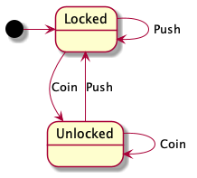
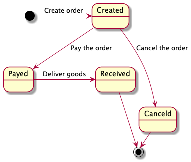

# SWState

A really easy to use but useful State Machine implementation with zero dependencies.

## Usage

Assume that we have a turnstile with 2 states `Locked`, `Unlocked` and 2 actions `Coin`, `Push`, as the diagram shows:



The main class that you use SWState is `StateMachine`, before using that, you should build it by class `StateBuilder`.

### Build the `StateMachine`
  
defined states：

```java
final String STATE_LOCKED = "Locked";
final String STATE_UNLOCKED = "Unlocked";
```  

Use `StateBuilder` to define Actions and Processes:

```java
StateBuilder<String, Serializable> stateBuilder = new StateBuilder<>();
stateBuilder
        .state(STATE_LOCKED)
        .in(order -> {
            // Handle before the turnstile is locked.
            System.out.println("turnstile is locked");
        })
        .state(STATE_UNLOCKED)
        .in(order -> {
            // Handle before the turnstile is unlocked.
            System.out.println("turnstile is unlocked");
        })
        .initialize(STATE_LOCKED)
        .action("coin_locked", STATE_LOCKED, STATE_UNLOCKED)
        .action("push_unlocked", STATE_UNLOCKED, STATE_LOCKED)
        .action("coin_unlocked", STATE_UNLOCKED, STATE_UNLOCKED)
        .action("push_unlocked", STATE_LOCKED, STATE_LOCKED);
StateMachine<String, Serializable> stateMachine = new StateMachine<>(stateBuilder);
```

As you can see, we have set up two states and four actions to change states.
the method `in()` bind your actual processing code block


### Use `StateMachine` to transit states as per previous definitions. 

```java
String id = "turnstile0-1";
stateMachine.start(id);
...
stateMachine.post(id, STATE_UNLOCKED);
...
stateMachine.post(id, STATE_LOCKED);
```

> The parameter `id` of `start()` or `post()` identifies the object that using this state machine, which means different ids have their own state.
> If states change with payload, call `postWithPayload` methods with payload, like `postWithPayload(id, payload)`.
> As of v2.2, If states change on current state conditionally, use `postOnState` and `postWithPayloadOnState` methods.

If no ID is used to identify an object, just call methods without ID:

```java
stateMachine.start();
...
stateMachine.post(STATE_UNLOCKED);
...
stateMachine.post(STATE_LOCKED);
```

### Trigger
As of version 2.0, Trigger is introduced to provide state transition automatically. 
Assume that the state transitions are determined just by some input, with trigger, you don't need to write the logic code by your own, it can be done automatically.

for example, by defining specific input to trigger the state transition:

* first, define the actions like this:
```java
stateBuilder
        ...
        .action("coin_locked", STATE_LOCKED, STATE_UNLOCKED, stateBuilder.triggerBuilder().c('a', 'A').build())
        .action("push_unlocked", STATE_UNLOCKED, STATE_LOCKED, stateBuilder.triggerBuilder().i(1).build())
        .action("coin_unlocked", STATE_UNLOCKED, STATE_UNLOCKED, stateBuilder.triggerBuilder().f(1.0f).build())
        .action("push_unlocked", STATE_LOCKED, STATE_LOCKED, stateBuilder.triggerBuilder().s("STRING1", "STRING2").build());
```
* to activate the state transition automatically, consume the input using `accept` method of `StateMachine` continuously:
```java
    stateMachine.accept('a'); // transit state from STATE_LOCKED to STATE_UNLOCKED
    stateMachine.accept(1); // transit state from STATE_UNLOCKED to STATE_LOCKED
    stateMachine.accept("unkown input") // THIS WON'T TRIGGER ANY STATE TRANSITION. 
```

* of course, custom trigger can be defined to handle specific situations, eg:
```java
.action("coin_locked", STATE_LOCKED, STATE_UNLOCKED, stateBuilder.triggerBuilder().c('a', 'A')
        .custom((data, payload) -> {
            return payload.content.equals("ALLOWED");
        )
        .build())
```
> this is equivalent to posting state by `post()` method.

## Advanced

The `StateMachine` stores states in memory by default, if you want to store states into other storages like RDB or nosql,
there are two ways to get this done, implement a `StateProvide` or use `StateTransition` directly.

Example:
Assume that we have simplified online shopping order processing with some order states, as the diagram shows:



defined states

```java
final String STATE_CREATED = "Created";
final String STATE_PAYED = "Payed";
final String STATE_CANCELED = "Canceled";
final String STATE_RECEIVED = "Received";
```

Set up Actions and Process with `StateBuilder`:

```java
StateBuilder<String, Order> stateBuilder = new StateBuilder<>();
stateBuilder
    .state(STATE_CREATED)
    .in(order -> {
    // Handle the order is created .
    })
    .state(STATE_PAYED)
    .in(order -> {
    // Handle the order is payed.
    })
    .state(STATE_CANCELED)
    .in(order -> {
    // Handle the order is canceled
    })
    .state(STATE_RECEIVED)
    .in(order -> {
    // Handle the delivery
    })
    .initialize("create order", STATE_CREATED)
    .action("pay order", STATE_CREATED, STATE_PAYED)
    .action("cancel order", STATE_CREATED, STATE_CANCELED)
    .action("deliver goods", STATE_PAYED, STATE_RECEIVED);
```

### Method 1: Customized State Provider

To store states, you need to implement a `StateProvider`, SWState provides a `DefaultStateProvider` which stores states
in memory, but it is probably not suit your situation. Usually, the states you want to manage are in a column of
DB tables, so let's implement a database version `StateProvider`.

`MyDatabaseStateProvider.java`

```java
import com.github.swiftech.swstate.StateProvider;

public class MyDatabaseStateProvider implements StateProvider<String> {
  public MyDatabaseStateProvider() {
      // do some necessary init
  }
  ... // implement all methods for storing or retrieving state from a database.
}
```

Replace the default state provider of state machine with yours:

```java
stateMachine.setStateProvider(new MyDatabaseStateProvider());
```

### Method 2: Use `StateTransition`

Instead of `StateMachine`, `StateTransition` is at lower level, it doesn't store current state but only process state transition.

First, construct instance of `StateTransition` just like `StateMachine` does.

```java
StateTransition<String, Order> stateTransition = new StateTransition<>(stateBuilder);
```

Second, use `stateTransition` to transit states which are loaded from other storage:

```java
public void pay(String id){
    String currentState = repository.getState(id); // repository is your own data access API
    stateTransition.post(currentState, STATE_PAYED); // if the current state is not 'Created', it fails as per previous setting
}
```

### Exception handling

As of v2.1, you can set whether to throw an exception when an internal exception occurs by calling `setSilent()`.
But you want to be notified when an exception occurs despite setting silence, call `setExceptionHandler()` to set an exception callback, e.g.:

```java
stateTransition.setSilent(true);
stateTransition.setExceptionHandler(stateException -> {
    System.out.println("exception: " + stateException.getMessage());
});
```

### IN/OUT process on self-circulation
By default, a self-circulation state transition still causes the IN/OUT processes to be executed. 
However, if you want to disable this default behavior in some cases, As of v2.2, the SWState allows you to control the IN/OUT processes for self-circulation state transition. 
Use `setNoInProcessForSelfCirculation()` and `setNoOutProcessForSelfCirculation()` to set whether the IN/OUT processes will be executed for self-circulation state transition.

## Maven

* Stable version

```xml
<dependency>
    <groupId>com.github.swiftech</groupId>
    <artifactId>swstate</artifactId>
    <version>2.0.1</version>
</dependency>
```

* Unstable version

```xml
<dependency>
    <groupId>com.github.swiftech</groupId>
    <artifactId>swstate</artifactId>
    <version>2.2</version>
</dependency>
```

> The Minimum JDK version is 17. if you are still stuck on the JDK 8, please use v1.1
